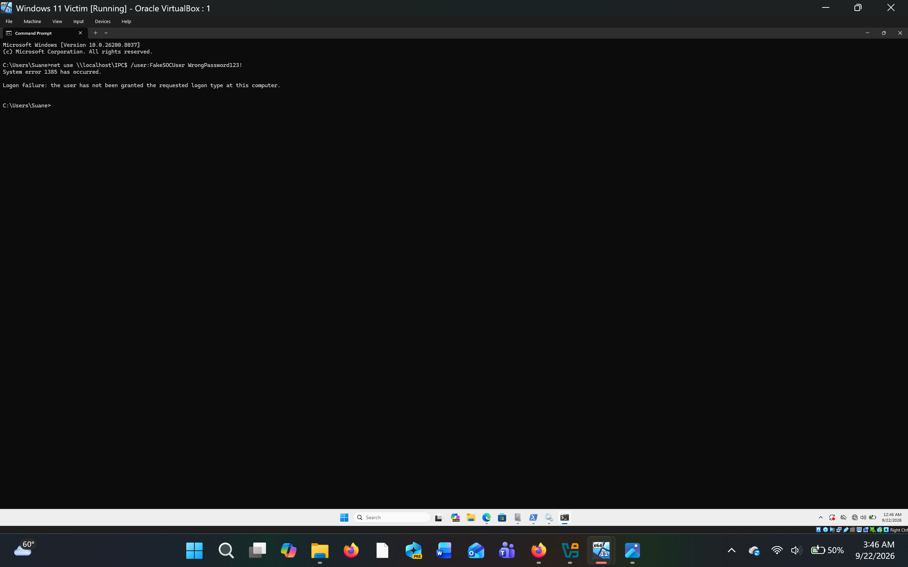
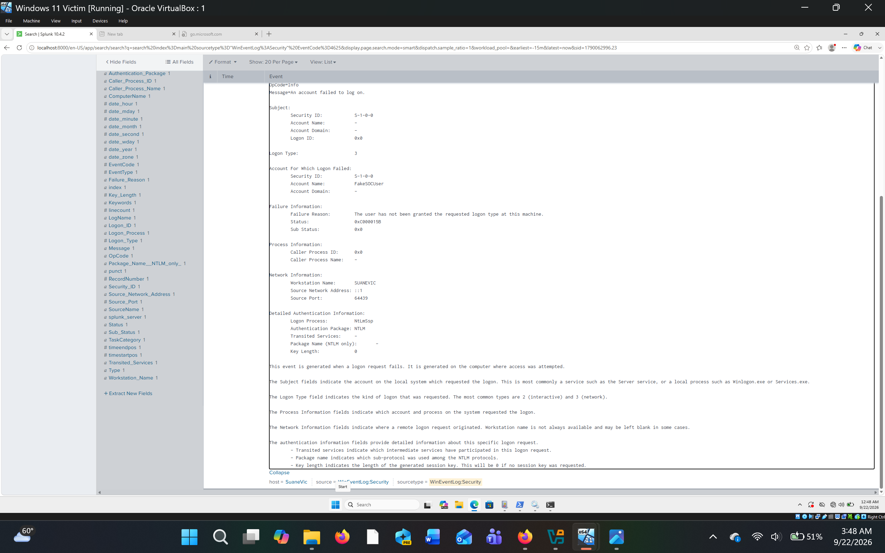
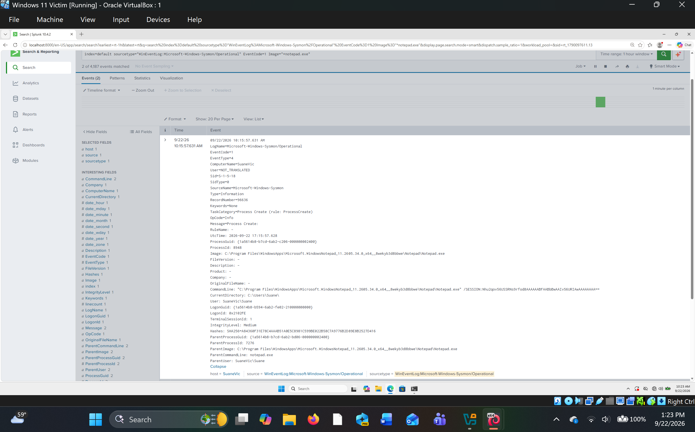
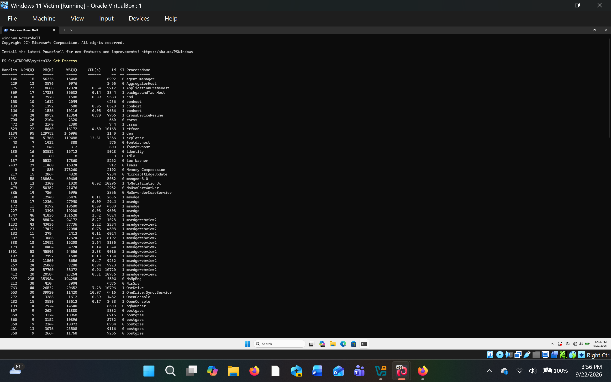
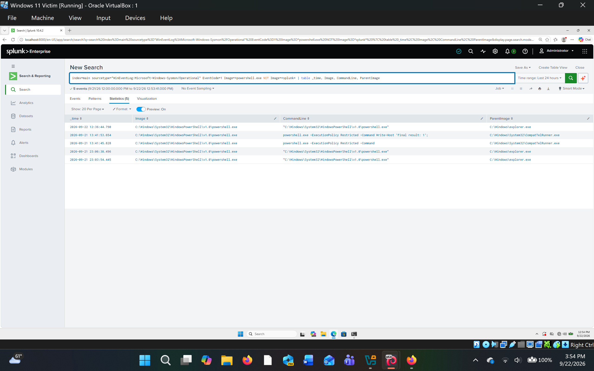
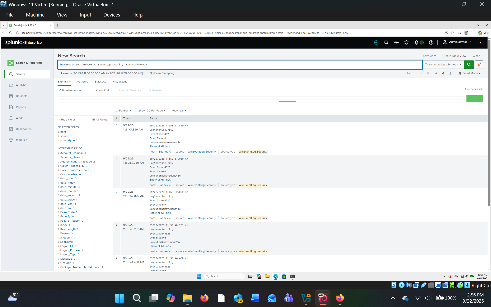
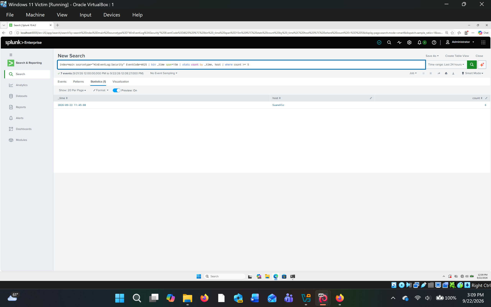
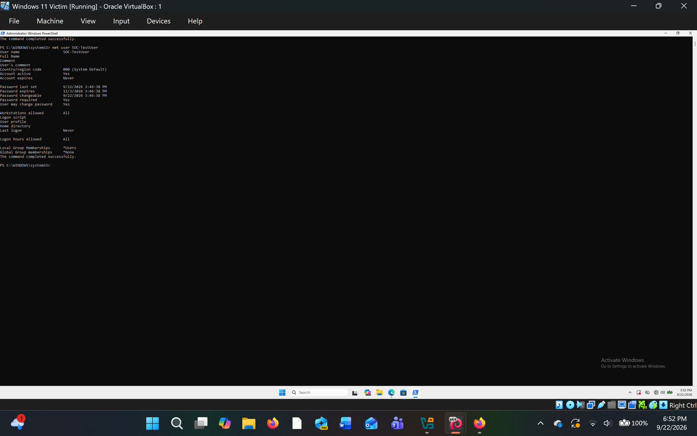
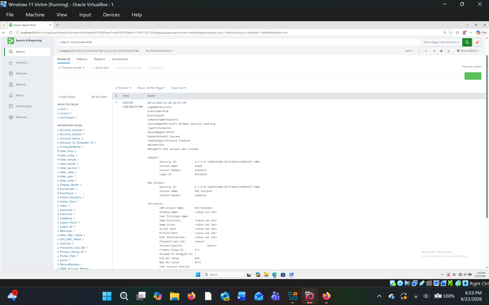

# SOC Home Lab

## Overview

This project documents the development of a Security Operations Center (SOC) home lab designed to practice security monitoring, log analysis, threat detection, and incident response.

## Objectives

- Build a virtualized security lab
- Collect and analyze security logs
- Practice Security Information and Event Management (SIEM)
- Investigate suspicious activity
- Identify Indicators of Compromise (IOCs)
- Map activity to MITRE ATT&CK
- Create security detections and alerts
- Document incident investigations

## Lab Environment

### Virtual Machines

| System | Operating System | Role |
|---|---|---|
| Kali Linux | Kali Linux | Security Testing / Attack Simulation |
| Windows 11 | Windows 11 | Monitored Endpoint |
| Metasploitable2 | Linux | Vulnerable Test System |

### Security Tools

| Tool | Purpose |
|---|---|
| Splunk | Security Information and Event Management (SIEM) |
| Sysmon | System Monitoring and Windows Event Logging |
| Wireshark | Network Traffic Analysis |
| Nmap | Network Discovery and Security Scanning |
| MITRE ATT&CK | Adversary Tactics, Techniques, and Common Knowledge |

### Network Architecture

The lab uses an isolated VirtualBox Host-Only network to allow the virtual machines to communicate within the lab environment.

```text
                    SOC HOME LAB

                       Splunk
                         |
                         | Security Logs
                         |
                  +------+------+
                  |             |
                  ▼             ▼
            Windows 11      Network Data
            Endpoint
                  ▲
                  |
          Controlled Activity
                  |
                  ▼
             Kali Linux
        Security Testing

                  |
                  ▼
           Metasploitable2
          Vulnerable System

## Phase 1: Network Configuration

### VirtualBox Network

The virtual machines were configured on an isolated VirtualBox Host-Only network.

### Connectivity Testing

Connectivity between Kali Linux and Windows 11 was verified using ICMP (Internet Control Message Protocol) ping testing.

Command:

```bash
ping -c 4 [Windows VM IP]
```
## Result

The connectivity test was successful.

- Packets transmitted: 4
- Packets received: 4
- Packet loss: 0%

Successful communication was established between the Kali Linux testing system and the Windows 11 monitored endpoint.


## Phase 2: Windows Log Collection

### Splunk Enterprise

Splunk Enterprise was configured to collect Windows Event Logs from the Windows 11 monitored endpoint.

### Event Logs

The following Windows Event Log channels were configured:

- Application
- System
- Security

### Log Collection Verification

Windows Security events were successfully indexed in Splunk Enterprise.

Search used:

```spl
index=main sourcetype="WinEventLog:Security"
```
## Failed Login Investigation

A controlled failed authentication test was performed on the Windows 11 victim machine using an invalid username and password.

### Splunk Search

```spl

index=main sourcetype="WinEventLog:Security" EventCode=4625
```

### Findings

- Event ID: 4625
- Event: An account failed to log on
- Account: FakeUser
- Logon Type: 3
- Source: Windows Security auditing

### Analysis

The failed login was intentionally generated as part of a controlled SOC lab exercise. Splunk successfully collected and displayed the Windows Security event.

In a real environment, repeated Event ID 4625 events could indicate password guessing or unauthorized access attempts and would require further investigation.

### Evidence





### Sysmon Log Collection

Sysmon was installed on the Windows 11 victim machine and configured to generate detailed Windows process and system activity logs.

The Sysmon Operational event channel was configured in Splunk Enterprise:

- Microsoft-Windows-Sysmon/Operational

### Sysmon Log Collection Verification

Sysmon events were successfully indexed and searchable in Splunk Enterprise.

Search used:

```spl
index=default sourcetype="WinEventLog:Microsoft-Windows-Sysmon/Operational"

## Sysmon Process Creation Investigation

A controlled process execution test was performed by launching Notepad on the Windows 11 victim machine.

### Splunk Search

```spl
index=default sourcetype="WinEventLog:Microsoft-Windows-Sysmon/Operational" EventCode=1 Image="*notepad.exe"
```
### Findings

- Sysmon Event ID: 1 (Process Creation)
- Process: Notepad.exe
- User: SuaneVic\Suane
- Integrity Level: Medium
- Source: Microsoft-Windows-Sysmon/Operational

### Analysis

Notepad.exe was intentionally launched as part of a controlled security test. Sysmon recorded the process creation event and Splunk successfully collected and displayed the event.

The activity was determined to be benign because the process was intentionally started during the test.

### Evidence



**PowerShell Process Listing**

PowerShell was used on the Windows 11 victim machine to display currently running processes using the `Get-Process` command.



**PowerShell Activity in Splunk**

The PowerShell activity was then searched in Splunk using Sysmon process creation events. The results show the PowerShell executable, command line, and parent process information.



## Brute-Force Login Detection

A controlled authentication test was performed on the Windows 11 victim machine by generating multiple failed login attempts.

### Detection Query

```spl
index=main sourcetype="WinEventLog:Security" EventCode=4625 | bin _time span=15m | stats count by _time, host | where count >= 5
```
### Findings

Splunk identified 7 failed authentication events from the Windows 11 victim host within the configured 15-minute detection window.

The events were associated with Windows Security Event ID 4625, which indicates that an account failed to log on.

### Analysis

This detection demonstrates how repeated failed authentication events can be identified using Splunk.

In a production environment, multiple failed logins within a short period could warrant investigation for possible password guessing or brute-force activity.

The activity in this lab was intentionally generated for testing purposes.

### Evidence





## Windows Account Creation Investigation

### Objective

Detect and investigate the creation of a new Windows local user account using Windows Security logs and Splunk.

### Controlled Activity

A test account named `SOC-TestUser` was created in the Windows lab environment using:

```powershell
net user SOC-TestUser <password> /add
```
### Splunk Detection

The event was identified using:

```spl
index=* EventCode=4720
```
### Analysis

The Splunk investigation identified a Windows Security Event ID 4720 associated with the creation of the `SOC-TestUser` account.

The event was reviewed to determine which account performed the account-creation activity and to verify the newly created account. The activity was intentionally generated in the lab environment, so it was considered expected rather than malicious.

From a SOC analyst perspective, unexpected account creation should be investigated because an unauthorized local account could potentially provide additional access to a system.

This investigation demonstrates the ability to identify account-creation activity, review event details, determine the context of the activity, and document the investigation using Splunk.

### MITRE ATT&CK

**T1136.001 — Create Account: Local Account**

This activity is associated with the MITRE ATT&CK technique for creating a local account on a Windows system.

The technique was mapped to this investigation because the lab activity involved creating the `SOC-TestUser` local account using the Windows `net user` command.

### Evidence





## Upcoming Phases


- Generate controlled security events
- Investigate suspicious activity
- Create Splunk detections
- Map activity to MITRE ATT&CK
- Complete Incident Response (IR) investigations
